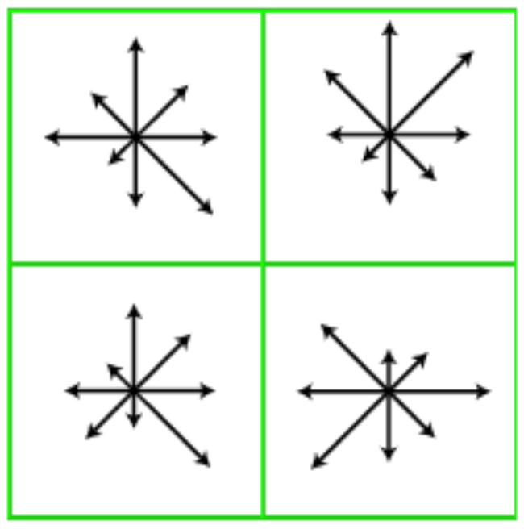

# feature-matching

### 1. Find key points using the Harris corner detector.  

The auto correlation function tells us how much the pixel value changes at each 
location in a patch when we slightly shift it. It is accompanied by a window
function that is often Gaussian which gives more weight to pixels closer to the
patch center. 

Mathemetically, the autocorrelation function is expressed as
$$E_{AC}(\delta u) = \sum_{\text{patch}} w(x_i)[I(x_i + \Delta u) - I(x_i)]^2$$
where $I$ is the given image, $x_i$ is the 2D pixel coordinate, $\Delta u$ is 
the displacement.

If the patch contains a corner, the $E_{AC}(\delta u)$ will be larger in all 
directions.
If the patch contains an edge, $E_{AC}(\delta u)$ be large in one direction.
If the patch is flat $E_{AC}(\delta u)$ will be small.

Using the first order Taylor expansion, we have $I(x_i + \Delta u) \approx I(x_i) 
+ \nabla I(x_i) \cdot \Delta u.$ Then the autocorrelation function can be approximated as

$$
\begin{equation}
\begin{split}
E_{AC}(\Delta u) &\approx \sum_i w(x_i)[I(x_i) + \nabla I(x_i) \cdot \Delta u - I(x_i)]^2 \\
                 &= \sum_i w(x_i)[\nabla I(x_i) \cdot \Delta u]^2  \\
                 &= \sum_i w(x_i)(I_x^2(x_i)\Delta x^2 + 2 I_xI_y(x_i)\Delta x \Delta y + I_y^2(x_i)\Delta y^2)\\
                 &= \sum_i w(x_i)\left(
                                \begin{matrix} 
                                \Delta x & \Delta y \\ 
                                \end{matrix} 
                                \right) 
                                \left(
                                \begin{matrix} 
                                I_x(x_i) & I_xI_y(x_i) \\
                                I_xI_y(x_i) & I_y(x_i) 
                                \end{matrix} 
                                \right)
                                \left(
                                \begin{matrix} 
                                \Delta x \\ 
                                \Delta y
                                \end{matrix} 
                                \right)\\
                 &= \sum_i \Delta u^T \left(
                                \begin{matrix} 
                                w(x_i)I_x(x_i) & w(x_i)I_xI_y(x_i) \\
                                w(x_i)I_xI_y(x_i) & w(x_i)I_y(x_i) 
                                \end{matrix} 
                                \right)  \Delta u\\
                &=  \Delta u^T \left(
                                \begin{matrix} 
                                \sum_i w(x_i)I_x(x_i) & \sum_i w(x_i)I_xI_y(x_i) \\
                                \sum_i w(x_i)I_xI_y(x_i) & \sum_i w(x_i)I_y(x_i) 
                                \end{matrix} 
                                \right)  \Delta u\\
                 &= \Delta u^T A \Delta u
\end{split}
\end{equation}
$$

where $A$ is called the auto-correlation matrix. 

Analyzing the eigenvalues of $A$ can tell us about the variance in the change in 
pixel values along the eigenvectors.  If the variance is large in two distinct 
directions, we can assume that the patch contains a "corner".

### 2. Root-SIFT keypoint-descriptor

Once we find the keypoints using the Harris corner detecter, we will create
discriptors based on its local features. 

Given a keypoint, extract a 16 x 16 patch centered at this keypoint. We then divide this 16 x 16 patch into four 4 x 4 sub-patches. For eatch of these 4 x 4 sub-patches, we look at the magnitude and the orientation of the image gradients ($I_x, I_y$) of the points in the sub-patch. We create a histogram of the orientations with 8 bins (-pi to pi divided by 8 intervals) while weighing the histogram counts with the gradient magnitudes. We then flatten this vector, take its square root (Root-SIFT) and normalize it. 

We match the keypoints in the two images based on the similarity of the descripters. The similarity is measured by Euclidean distance and a match is determined by the ratio ($\frac{d1}{d2}$) between the closest feature($d1$) and the second closest feature($d2$). If the ratio is close to 1, we cannot be sure whether the closest or second closest is the true match. It is up to us to set this threshold. 

